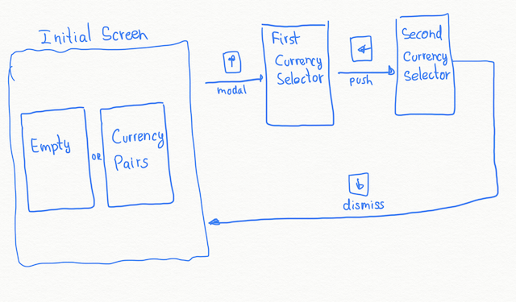

# RCC

> Fetches current exchange rates between diferent currencies

[![Swift Version][swift-image]][swift-url] 

## Screenshots

## Requirements

### Initial screen
- [] On first launch should show empty screen
- [] Screen should allow adding new _pairs_
- [] Configured _pairs_ should be persisted between launches
- [] If _pairs_ have been already persisted, they should be shown on launch
- [] Newly configured _pairs_ should be added on top of older ones

### First currency selector
- [] Screen with available currencies is presented modally
- [] The first `main` currencies are __GBP__, __EUR__ and __USD__; and should appear first
- [] `Other` available currencies are to be ordered alphabetically
- [] One can select one and only one currency, 
- [] On selection you are conducted to another screen in order to select its pair currency

### Second currency selector
- [] Screen for selecting the pair of the previous currency is presented
- [] You can select one and only one currency
- [] The order is the same as in the previous screen
- [] The previously selected currency as well as other currencies for wich a pair with the previous currency is already defined can't be selected
- [] On selection the screen is dismissed and you are conducted to the initial screen where the configured _pair_ is shown

## Structure
| Module       | Layer                 | Contains                                   | Dependencies                                     |
|--------------|-----------------------|--------------------------------------------|--------------------------------------------------|
| Converter    | Domain                | Entities, Use Cases, Repository interfaces | Foundation                                       |
| Data         | Data                  | Repositories, Networking, Database         | Foundation, CoreData, Converter                  |
| Presentation | Presentation          | ViewModels, Mappers                        | Foundation, Converter                            |
| RCC          | Composition Root, App | UI, Assemblers                             | Foundation, UIKit, Converter, Data, Presentation |

### Converter
> The feature itself, provides the currencies as well as the business rules that govenr the app.

1. Provides the configured __Exchange Pairs__, e.g.: `GBP-USD`, `EUR-AUD` with the conversions between both currencies.
2. Establishes an update rythm of the data.
3. Provides the rules for the construction of new __Exchange Pairs__.

## Other
- Swift 5
- iOS 12.0+

## Meta

[swift-image]:https://img.shields.io/badge/swift-5.0-orange.svg
[swift-url]: https://swift.org/
